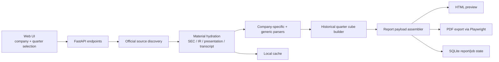

# Earnings Digest Studio

Earnings Digest Studio is a web-based research tool for generating high-density quarterly earnings reports as previewable HTML and exportable PDF.

The product is designed for a single workflow:

- choose a listed company
- choose a calendar quarter
- dynamically fetch official materials
- parse KPI, structure, guidance, call highlights, and historical trend data
- generate a polished deep-dive report automatically

## What It Does

- Generates `14-18` page deep-dive earnings reports
- Covers current-quarter KPI, guidance, call themes, risks, catalysts, and evidence cards
- Includes a fixed `12-quarter` growth, structure, and profitability module
- Uses the same HTML template for web preview and PDF export
- Supports optional transcript upload in `PDF / TXT / HTML`
- Prioritizes official sources and uses local cache only to accelerate re-use

## Tech Stack

- FastAPI
- Jinja2 templates
- SVG-based chart rendering
- Playwright for PDF export
- SQLite for local report/job state

## System Flow



## Quick Start

### 1. Clone the repository

```bash
git clone https://github.com/coattail/Earnings-Digest-Studio.git
cd Earnings-Digest-Studio
```

### 2. Create a virtual environment

```bash
python3 -m venv .venv
source .venv/bin/activate
```

### 3. Install dependencies

```bash
pip install -e .
python -m playwright install chromium
```

### 4. Start the app

```bash
uvicorn app.main:app --reload
```

Then open:

`http://127.0.0.1:8000`

## Run Tests

```bash
python -m unittest discover -s tests
```

## Quality Audit (All Companies / All Quarters)

Use the built-in audit script to batch-check generation quality without manually opening each company-quarter report.

```bash
EARNINGS_DIGEST_DISABLE_SOURCE_FETCH=1 ./.venv/bin/python scripts/audit_dynamic_reports.py \
  --all-quarters \
  --history-window 12 \
  --allow-fallback \
  --strict \
  --output tmp/audit-all.json \
  --summary-markdown tmp/audit-summary.md
```

`--strict` exits non-zero when any quarter is `fail` or `error`.
`--allow-fallback` runs the legacy baseline quality rules (useful for offline/cache-only CI runs).

To enforce **no-fallback full coverage** (recommended for production acceptance), run:

```bash
./.venv/bin/python scripts/audit_dynamic_reports.py \
  --all-quarters \
  --history-window 12 \
  --strict \
  --output tmp/audit-full-coverage.json \
  --summary-markdown tmp/audit-full-coverage.md
```

Full-coverage mode requires online official-source fetching; do **not** set `EARNINGS_DIGEST_DISABLE_SOURCE_FETCH=1`.

To refresh the runtime-ready quarter map from a true full-history audit, write it in the same run:

```bash
./.venv/bin/python scripts/audit_dynamic_reports.py \
  --all-quarters \
  --strict \
  --write-ready-map data/cache/full-coverage-ready-quarters.json \
  --output tmp/audit-full-coverage.json \
  --summary-markdown tmp/audit-full-coverage.md
```

When `--write-ready-map` is enabled, the audit automatically includes quarters that are still hidden from current product selectors so the resulting map can reopen newly-passing historical periods.
If a full run times out, rerun the exact same command with `--resume` and the existing `--output` path; the audit will skip companies that already have quarter results persisted in that JSON checkpoint.

At runtime, report generation now uses full-coverage gate by default. You can temporarily disable it with:

```bash
EARNINGS_DIGEST_REQUIRE_FULL_COVERAGE=0
```

The JSON output now includes `summary.focus_companies` and per-company `top_issue_codes` to help prioritize parser and data-coverage fixes.
Quarter selectors now default to report-ready periods only (history window must have complete revenue + net-income coverage).
GitHub Actions workflow [`quality-gate.yml`](.github/workflows/quality-gate.yml) runs this strict audit automatically and uploads JSON/Markdown artifacts.

To inspect parser backlog (including quarters hidden from product selectors), add `--include-unready` with `--all-quarters`.

## API Overview

The app ships with both page routes and JSON endpoints.

| Endpoint | Method | Purpose |
| --- | --- | --- |
| `/` | `GET` | Home page |
| `/companies` | `GET` | List supported companies and themes |
| `/companies/{company_id}/quarters` | `GET` | Return available quarter options |
| `/uploads` | `POST` | Upload transcript material |
| `/reports` | `POST` | Generate a report synchronously |
| `/report-jobs` | `POST` | Start async report generation with progress |
| `/report-jobs/{job_id}` | `GET` | Poll job progress |
| `/reports/{report_id}` | `GET` | Return report payload |
| `/reports/{report_id}/preview` | `GET` | Open HTML preview |
| `/reports/{report_id}/export.pdf` | `POST` | Export report to PDF |
| `/reports/{report_id}/download.pdf` | `GET` | Download generated PDF |

### Example: create a report job

```bash
curl -X POST http://127.0.0.1:8000/report-jobs \
  -H "Content-Type: application/json" \
  -d '{
    "company_id": "alphabet",
    "calendar_quarter": "2025Q4",
    "history_window": 12,
    "force_refresh": false
  }'
```

### Main request body

```json
{
  "company_id": "alphabet",
  "calendar_quarter": "2025Q4",
  "history_window": 12,
  "manual_transcript_upload_id": null,
  "force_refresh": false
}
```

## Data Expectations

This repository can dynamically fetch official materials on demand, but it also expects two local structured data sources for baseline historical series and legacy segment support:

- `../Tech-Analysis/data.js`
- `../nvidia-revenue-chart/data/nvidia_quarterly_revenue_by_segment.csv`

These paths are referenced in [app/config.py](app/config.py).

If you do not keep those repositories as sibling folders, you have two options:

1. place the required datasets in equivalent relative locations
2. update the path constants in [app/config.py](app/config.py) to match your local setup

## Generated Data and Cache

The app creates a local `data/` directory at runtime for:

- `data/cache/`: official materials, discovered sources, and other reusable cache
- `data/uploads/`: optional user-uploaded transcripts
- `data/exports/`: generated PDF files
- `data/earnings_digest.sqlite3`: local app database

These files are not required to be committed. They can be deleted and rebuilt.

## Repository Layout

```text
app/
  main.py                  FastAPI entrypoint
  config.py                app paths and shared constants
  templates/               home page and report HTML templates
  static/                  CSS and client-side JS
  services/                parsing, report building, charts, export, and source resolution
scripts/                   helper scripts for OCR and auditing
tests/                     unittest suite
data/                      runtime cache, exports, uploads, and SQLite state
```

## Parsing Strategy

- Prefer official-source parsing over static fixtures whenever source material is available.
- Combine company-specific parsers with generic parsing instead of relying on one universal extractor.
- Backfill historical structure and KPI fields quarter by quarter when the latest report alone is not enough.
- Keep cache as a speed layer only, not as the product itself.
- Make disclosure limitations explicit when an issuer truly does not publish a stable split.

## Current Status

The project already supports:

- a web UI for company and quarter selection
- preview and PDF export
- dynamic official-source discovery
- historical 12-quarter analysis
- company-specific parser extensions for multiple large-cap U.S. and ADR names

The codebase is still evolving, especially in:

- historical parser coverage for older quarters
- source normalization across companies
- report-generation speed and cache strategy
- layout refinement for edge-case reports

## FAQ

### Is this a pre-baked report library?

No. The intended workflow is on-demand generation. The app discovers official materials, fetches them, parses them, and assembles a report when the user requests one. Local cache exists only to speed up repeated runs.

### Why is first-run report generation sometimes slow?

Because the pipeline may need to:

- discover official IR and SEC sources
- download or hydrate source materials
- parse long filings, decks, and call materials
- backfill a 12-quarter historical window

Repeat runs are faster because source and material cache can be re-used.

### Can I delete the `data/` folder?

You can safely delete cache, exports, uploads, and the SQLite database. The app will recreate runtime directories automatically. Deleting them just removes local state and cached materials.

### Why do some companies still need custom parser logic?

Official disclosure formats vary widely across issuers and across time. The codebase uses both generic parsing and company-specific parsing to keep structure, KPI, and geography extraction usable across current and historical quarters.

### Does the project require downloaded source libraries committed to git?

No. Runtime source files live under `data/cache/` and are ignored by git. The repository only stores code, templates, tests, and lightweight directory placeholders.

## Roadmap

- Improve older-quarter parser coverage across the full company pool
- Reduce first-run latency for deep historical backfill
- Further normalize geography and segment taxonomy across issuers
- Improve progress reporting so long stages feel more truthful
- Expand report QA around edge-case layouts and sparse disclosures
- Add more maintainable source adapters for companies with unstable IR pages

## Contributing

Contributions are welcome, especially in these areas:

- parser robustness
- PDF layout quality
- source discovery reliability
- test coverage for historical edge cases
- documentation and setup experience

Suggested workflow:

1. Fork the repository
2. Create a feature branch
3. Add or update tests when behavior changes
4. Keep runtime cache and generated files out of commits
5. Open a pull request with a concise explanation of the change

## License

No license has been added yet. Until a license is explicitly published, reuse rights are not granted by default.

## Notes

- First-run report generation is slower because official materials may need to be discovered and downloaded.
- Repeated generation is faster because reusable source/material cache is stored under `data/cache/`.
- PDF export depends on Playwright Chromium being installed locally.
